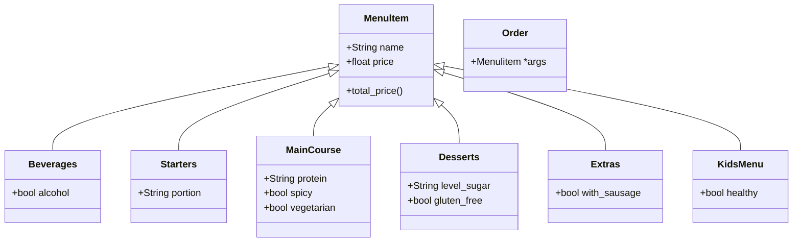

# Reto-03
## Restaurant Scenario
Diagram:

Example of code output (included in the repository):
```python
menu = Order(
            Beverages("Coke", 5.4, False), 
             Beverages("Wine", 20, True), 
             Beverages("Appel Juice", 6.2, False), 
             Starters("Spring rolls", 10.45, "Small"), 
             Starters("Soup", 5.8, "Medium"), 
             MainCourse("Spaghetti Bolognese", 16.7, "Meat", False, False),
             MainCourse("Curry", 18, "Tofu", True, True),
             MainCourse("Grilled salmon with vegetables", 20, "Salmon", False, False),
             Desserts("Cheesecake", 8.9,"Medium", False),
             Desserts("Strawberry Donut", 4.67, "High", True),
             Extras("French Fries", 6.98, True),
             KidsMenu("Pizza", 11.76, False))
menu.add_items(Extras("Salad", 4.5, False))
menu.print_bill(10)
```
```
Coke - $5.40
Wine - $20.00
Appel Juice - $6.20
Spring rolls - $10.45
Soup - $5.80
Spaghetti Bolognese - $16.70
Curry - $18.00
Grilled salmon with vegetables - $20.00
Cheesecake - $8.90
Strawberry Donut - $4.67
French Fries - $6.98
Pizza - $11.76
Salad - $4.50

Subtotal: $139.36
Discount: -$13.94
Total Due: $125.42
```
