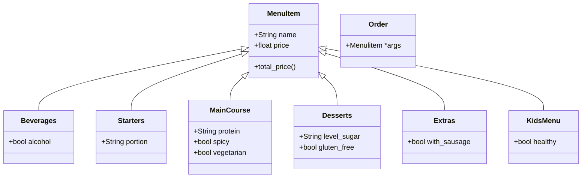

# Reto-03
## Restaurant Scenario

```mermaid
classDiagram
direction TB
    class Menultem {
	    +String name
	    +float price
	    +total_price()
    }

    class Beverages {
	    +bool alcohol
    }

    class Starters {
	    +String portion
    }

    class MainCourse {
	    +String protein
	    +bool spicy
	    +bool vegetarian
    }

    class Desserts {
	    +String level_sugar
	    +bool gluten_free
    }

    class Extras {
	    +bool with_sausage
    }

    class KidsMenu {
	    +bool healthy
    }

    class Order {
	    +Menulitem *args
    }

    Menultem <|-- Beverages
    Menultem <|-- Starters
    Menultem <|-- MainCourse
    Menultem <|-- Desserts
    Menultem <|-- Extras
    Menultem <|-- KidsMenu

```
